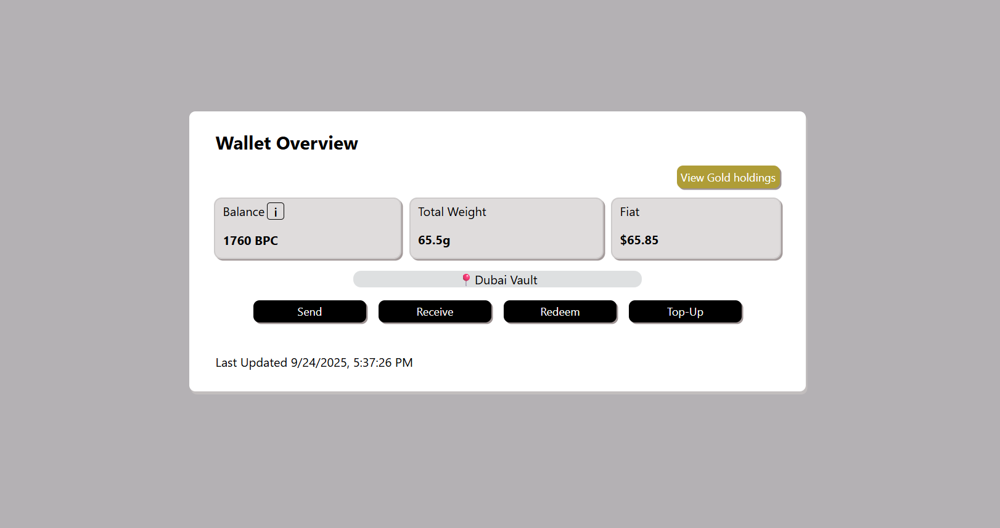
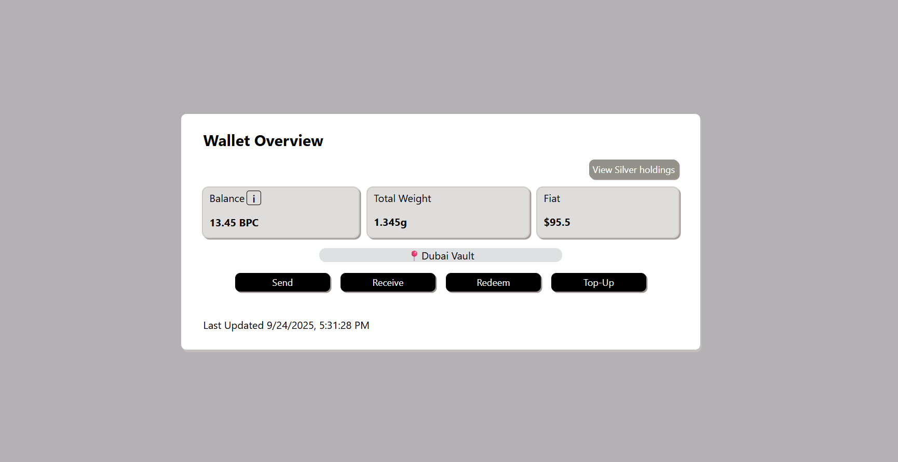

# Wallet Overview Component – Goldenia Dashboard

This project implements a Wallet Overview component for Goldenia’s web dashboard.  

##  Features

- **Balance Display**
  - Shows BPC balance (Bullion Payment Cryptocurrency).
  - Shows equivalent gold/silver weight in grams.
  - Shows fiat equivalent in USD.
  - Tooltip explaining what BPC is.
- **Vault Location**
  - Displays the vault tag (e.g., “📍Dubai Vault”).
- **Toggle Holdings**
  - Switch between Gold and Silver holdings with a toggle button.
- **Last Updated Timestamp**
  - Displays the last refresh time.
- **Action Buttons**
  - Placeholder buttons: Send, Receive, Redeem, Top-Up.
- **Loading State**
  - Uses `react-loading-skeleton` for placeholders while data is loading.

##  Tech Stack

- React (JavaScript)  
- CSS Modules for modular, scoped styling.  
- Flexbox & Media Queries for responsive layout.  
- Mock data provided via a simple object (`mockdata.js`).

## Video Demo

Watch the WalletOverview component (https://www.loom.com/share/686de2976bdf4455ace2ceaae40eb804?sid=57dd1e2f-353a-4de8-97d4-35e28ec86b3f)

## ScreenShots
Wallet overview component with silver holdings

Wallet overview component with gold holdings

Tooltip for BPC appears when you hover over it

Loading Skeleton

Wallet Overview on Mobile screen

